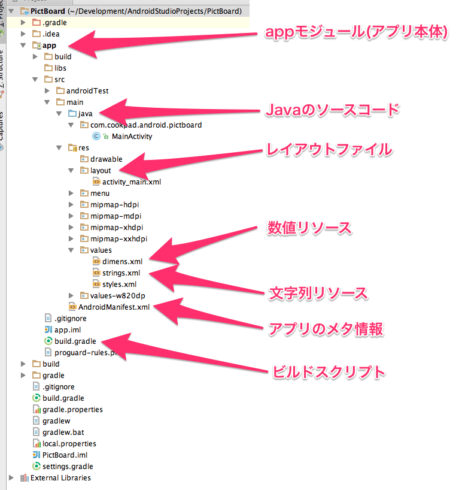
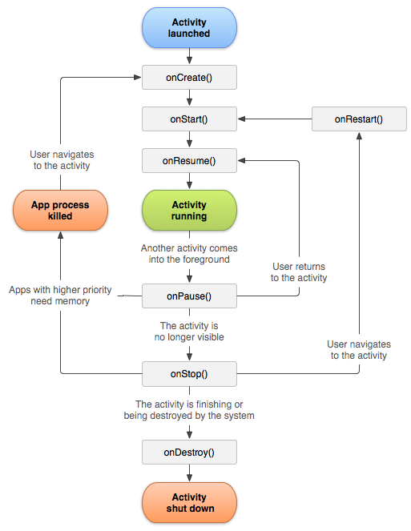
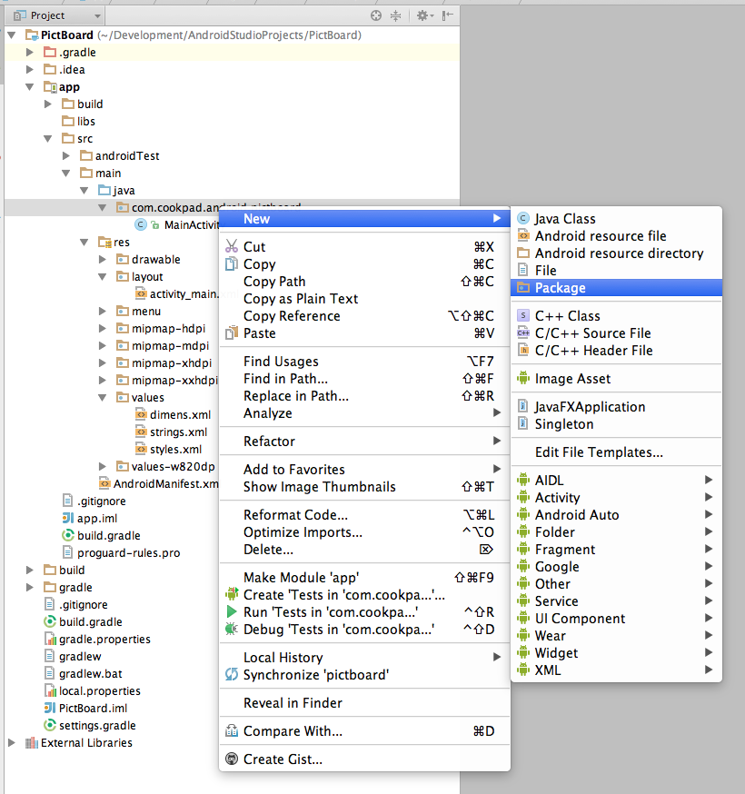

# この講義でやること

Railsの講義で作ったAPIを利用して、閲覧/コメント投稿ができるAndroidアプリを作成します。

# この講義で扱う開発環境/ツール

* Android Studio 1.3
* Java 1.7相当

# この講義で作るAndroidアプリ

* 投稿された画像一覧を表示する
* 選択した画像に付けられたコメント一覧を表示する
* 選択した画像に対してコメントを投稿する

# このアプリを作るには

* Androidプロジェクトの構成
* xmlを使ったレイアウトの組み方
* リスト表示
* 画面遷移の方法
* ネットワーク通信
* イベント駆動な処理の書き方

を理解しましょう

# ざっくりJava入門
AndroidアプリはJavaで書くことができます。
ざっくりと基本的なJavaの用語と書き方を説明します。

## 変数
変数の型と変数名で宣言します。指定した値で初期化することもできます。

```java
int i = 0;
```

## 定数
定数はたいていクラス変数として宣言するため、以下のように記述します。

```java
private static final String HOST = "192.168.0.1";
```

定数を定義するには、以下の3つの用語を知る必要があります。

- アクセシビリティ
- static
- final

これらの知識は定数の宣言の他に、クラスの宣言やメソッドの宣言にも使用します。
順に説明します。

### アクセシビリティ
この変数がどこからアクセスできるかを表します。

|アクセシビリティ|参照できる範囲               |
|-------------|---------------------------|
|private      |クラス内のみ                 |
|protected    |クラス内・継承関係の子クラスから|
|何もつけない   |同じパッケージ内             |
|public       |どこからでも                 |

この講義内ではpublicとprivateだけを使います。

### static
インスタンスを生成しなくてもアクセスできる変数もしくはメソッドであることを表します。

### final
再代入不可な変数であることを表します。

```java
final int i = 0;
i = 1; // コンパイルエラー
```

## 型
### プリミティブ型
真偽を表すbooleanや、数値を表すint、浮動小数を表すdoubleなどがあります。

```java
boolean available = true;
int age = 18;
double point2 = 0.3;
```

### 参照型
プリミティブ型と対比して参照型というものがあります。オブジェクト型ともいいます。
参照型は基本的に`new`を使ってインスタンスを生成します。
文字列は例外的にダブルクォーテーションで囲めばOKです。（シングルクォーテーションだとcharになってしまいます）

```java
Date now = new Date();
String name = "Taro";
```

### ラッパー型
プリミティブ型にはそれぞれラッパークラスという参照型が用意されています。
ラッパークラスにはそれぞれのプリミティブ型への変換などの便利なメソッドが用意されています。
またラッパークラスのインスタンスは、プリミティブ型と同等の値を表す存在でもあります。

|プリミティブ型|ラッパークラス|
|------------|------------|
|boolean     |Boolean     |
|int         |Integer     |
|double      |Double      |

```java
int age = Integer.parseInt("18"); // 文字列から数値への変換
boolean available = Boolean.parseBoolean("true") // 文字列から真偽値への変換

System.out.println(18 == new Integer(18)); // true
```

## 配列
配列を使う場合には型に`[]`をつけて、データは`{}`の中に入れます。

```java
int[] scores = new int[3]; // 配列の要素数を指定する必要があります。
scores[0] = 50;
scores[1] = 88;
scores[2] = 14;

String[] names = {"Taro", "Hanako", "Jiro"}; // 内容を指定して初期化時する場合、要素数を指定する必要はありません。
int[] scores = {50, 88, 14};

System.out.println(scores[0]) // 50
System.out.println(scores.length); // 3
```

## リスト
配列の場合には要素数が決まってなければなりませんが、リストは可変長配列として扱えます。
リストに入れられるのは参照型だけなので、プリミティブ型のままでは入りません。リストに入れようとした場合は自動的にラッパークラスに変換されます。（Auto Boxing）
リストにどんな値を入れるかはジェネリクスで指定をします。`<>`で囲われた部分です。

```java
List<Integer> scores = new ArrayList<Integer>();
scores.add(50);
scores.add(88);
scores.add(14);

System.out.println(scores.get(0)) // 50
System.out.println(scores.get(1)) // 88
System.out.println(scores.size()); // 3
```

## 制御構文
### if
条件分岐には`if`を使用します。

```java
if (age < 20) {
  // 20歳未満の場合
} else if (age >= 80) {
  // 80歳以上の場合
} else {
  // それ以外
}
```

### for
繰り返しには`for`を使います。

```java
int sum = 0;
for (int i=0; i<10; i++) {
  sum += i;
}
System.out.println(sum); // 0 + 1 + 2 + 3 + 4 + 5 + 6 + 7 + 8 + 9 = 45
```

配列やリストをなめる場合には拡張for文が便利です。

```java
String[] names = {"Taro", "Hanako", "Jiro"};
for(String name : names) {
  System.out.println(name);
}
// Taro
// Hanako
// Jiro
```

## クラスやメソッドの定義

基本的なクラスの宣言方法です。

```java
package com.example.model; // namespaceを表します。

// Studentクラスの宣言
public class Student {

  private String name; // インスタンス変数

  private int age;

  /*
   * コンストラクタ
   * インスタンス生成時に最初に実行されるメソッドです。
   */
  public Student(String name, int age) {
    this.name = name;
    this.age = age;
  }

  /*
   * メソッド
   */
  public String getName() {
    return name;
  }

  public int getAge() {
    return age;
  }

  /*
   * staticメソッド
   * インスタンスを作らずに呼びだすことができるメソッドです。
   */
  public static int computeAverageScore(Student[] students) {
    int sum = 0;
    for(Student student : students) {
      sum += student.getAge();
    }
    return sum / students.length;
  }
}
```

## 内部クラス
1つのソースコードに1つのクラスだけ宣言する場合が多いですが、クラスの中にクラスを宣言することもできます。

```java
public class Student {

  private String name;

  public Student() {
    this.name = name;
  }

  public String getName() {
    return name;
  }

  public static class InnerClass {
    public void something() {
      // hogehoge
    }
  }
}
```

内部クラスの宣言にstaticをつけると、外部クラス(Student)のインスタンスを作らなくても内部クラス(InnerClass)のインスタンスを作ることができるようになります。

## 継承

Javaで特定のクラスを継承する時にはextendsというキーワードを使用します。

```java
public class Person {
  public String getName() {
    return "Taro";
  }
}

public class Student extends Person {
  public int getStudentId() {
    return 1;
  }
}

Student student = new Student();
System.out.println(student.getStudentId()); // 1
System.out.println(student.getName()); // Taro
```

## インターフェイス
実装を含まない、メソッドの引数と戻り値だけを定義したクラスです。

```java
public interface List {
  public E get(int location);
  // ....
}
```

インターフェイスを実装する時には`implements`を使用します。

```java
public class CustomList implements List {
  List<Byte> list = new ArrayList<>();

  public E get(int index) {
    if (index >= size) {
      throwIndexOutOfBoundsException(index, size);
    }
    return (E) array[index];
  }
  // ....
}
```

もしくはそのままnewすることで無名クラスとして扱うこともできます。
処理をメソッドに渡したい場合は無名クラスを使う場合が多いです。

```java
// button.setOnClickListener(OnClickListener onClickListener)
submitButton.setOnClickListener(new View.OnClickListener() {
    @Override
    public void onClick(View v) {
    // ここにクリックされた時の処理を記述する
    }
});
```

## アノテーション
メソッドやクラスなどの宣言につけるメタ情報です。
この情報を目印にソースコードの自動生成や、自動テストのスキップなどの制御を行います。

```java
public class Student {
  @SerializedName("age") // GSON(JSONパーサ)のJSONキーの値を示すアノテーション
  private int age;

  @SereializedName("name")
  private String name;
}
```

# プロジェクトの作成

Javaの文法をひと通り把握したところで、アプリ開発を始めていきましょう。
AndroidStudioを起動すると、下のようなダイアログが表示されると思います。


`Start a new Android Project`を選択して、新しいプロジェクトを作成しましょう。


```
Application name: PictBoard
Company Domain: android.cookpad.com
```

`Application name`と`Company Domain`を変更しましょう。


今回はスマートフォンアプリを作成するので、Phone and Tabletにチェックが入ってる状態で問題ありません。
Minimum SDKによって、どこまで古いOS versionをサポートするか変更できます。
help me chooseを選択すると、世界中でどのバージョンのAndroidが使われているかグラフが表示されます。これを参考に設定しましょう。
実際の業務ではターゲットとなる市場のユーザーがどのバージョンを使っているか、そのバージョンを使うことで作りたいアプリを作ることができるかなどを考える必要があります。


今回はサンプルアプリを作るだけなので、デフォルトの設定のままOS 4.1以上をサポートすることにしましょう。


初期画面の選択をします。
Blank Activityを選択し、次に進みましょう。


初期画面の名前や、関連のファイル名の変更ができますが、
何も変更せず`Finish`を選択しましょう。

# gitによる管理

railsの講義と同様に、Androidの講義で作成したアプリはgithub上に提出してもらいます。
そのため、Androidのプロジェクトもgitで管理しておきましょう。

ターミナルから、いま作成したプロジェクトのrootディレクトリに移動して、
`git init`を行い、この段階で初コミットをしましょう。
今後のコミットするタイミングについては、各々の判断におまかせします。

# Helloworldを実行する

プロジェクトを作成した段階で、Hello worldを表示するプログラムが組まれています。
実際に、Hello worldを手元のエミュレータで実行させてみましょう。
緑色の再生ボタンを押すと、ビルドが開始されます。


端末選択画面が表示されたら、起動しているEmulatorを選択し、OKでアプリを起動させましょう。


このような画面が表示されたら成功です。


## ログの表示方法と出力方法

どんな開発でもログ出力なしで開発していくことはできません。AndroidアプリのログはAndroidStudioで表示することができます。


これからアプリを開発していくなかで、何らかのログ出力したい場合には以下のように書きます。

```java
Log.d("Hoge", "This is debug log message");
Log.i("Hoge", "This is information log message");
Log.w("Hoge", "This is warning log message");
Log.e("Hoge", "This is error log message");
```

ログの緊急度や用途によって呼び出すメソッドが異なります。
それぞれのメソッドでは、第一引数にはタグを渡して、第二引数にはログメッセージを渡します。
タグは文字列であれば自由に設定可能で、ログの種類をわけるために使用します。

# Androidプロジェクトの構成

## プロジェクトの表示方式の変更

デフォルトの表示では、プロジェクトの構造がコンパクトにまとめられていますが、
実際のディレクトリ構造と異なり、混乱する可能性があるので表示方式をAndroidからProjectに変更しましょう。


## プロジェクト構成の説明



### app モジュール

アプリ(やライブラリ)はモジュールという単位で管理されています。 一つのプロジェクトに複数のモジュールを共存させることも可能です。
app という名前には特に意味はなく、Android Studioでプロジェクトを作成すると、デフォルトでapp ModuleにHelloworldのプログラムが作成されます。

### java ディレクトリ

javaディレクトリでは、アプリケーションコードを管理します。
ファイルが増えてくると管理が難しくなるので、適切にパッケージ(ディレクトリ)を分けましょう。

### res ディレクトリ

リソースディレクトリでは、アプリの素材画像、xmlのレイアウト、アイコン用の画像ファイル、文字列、数値などを管理します。
文字列や数値をアプリケーションコードとは別で管理するのは、表示言語の国際化(i18n)やマルチデバイスに対応するためです。

### AndroidManifest

アプリのメタ情報がXML形式で記述されています。
新たにパーミッションを追加する場合や、画面(Activity)を作成した場合時にAndroidManifestに追記する必要があります。

### build.gradle

ビルドする際の設定を記述します。
build.gradleは、rubyでいうところの`Gemfile`の役割も備えているので、
ライブラリを利用する際は、使用するライブラリをbuild.gradleのdependenciesに記述します。

# Activity

Androidでは、ひとつの画面がActivityという単位で構成されています。
新たに画面を追加する == 新しいActivityを作成することになります。
AndroidにMVCの概念はないですが、Railsにおける`Controller`の役割に少し近いです。

## Activityのライフサイクル



Activityは生成されてから破棄されるまでに、システム側がイベントと称してonCreate()やonStart()などのメソッドを順番に呼びます。
この一連の流れをActivityのライフサイクルと呼んでいます。またライフサイクルによって実行されるメソッドをライフサイクルイベントと呼んでいます。
Androidプログラミングでは、どのライフサイクルイベントに処理を記述するかが重要で、適切で無いライフサイクルイベントに処理を書いてしまうと、アプリが落ちたり、重くなったりします。

特に重要なライフサイクルイベントについて説明します。

### onCreate
Activityの画面が作られるときに呼ばれるライフサイクルイベントです。
ライフサイクルの中では一番最初に呼ばれると考えて問題ありません。

このライフサイクルイベントでは、画面(view)の作成や、Activityの初期化処理(ListViewとAdapterの接続や、各viewに対するイベントリスナーの登録)を記述します。
今回の講義でも、ほとんどの処理を`onCreate`内に実装することになります。

### onDestroy
`onCreate`と対になっているライフサイクルイベントで、Activityが破棄される時に呼ばれるライフサイクルイベントです。
初期化処理に対になって終了処理をここに書くとよいかもしれませんが、このライフサイクルイベントが呼ばれないケースがあるので、あまり重要なことは書けません。

### onResume
このイベントが呼ばれるのは、Activityが画面に表示される時と、バックグラウンドから復帰した場合の2パターンが存在します。
今回の講義では使用しませんが、ここにはカメラやセンサーなどの端末のリソースを獲得するコードを書くのに向いています。

### onPause
このイベントが呼ばれるのは、別のActivityに遷移した時と、ホームボタンなどを押してアプリ自体がバックグラウンドに引っ込んだ場合などです。
`onResume`と対になっているライフサイクルイベントなので、`onResume`で獲得したリソースを開放するのに向いています。


その他のコールバックメソッドについては、Activityクラスの公式ドキュメントに詳しく解説していますので、参照してください。
http://developer.android.com/reference/android/app/Activity.html#ActivityLifecycle

# 画面レイアウトの組み立て

AndroidアプリのviewはXMLで記述します。
Android Studioには、GUIのレイアウトビルダーもありますが、意図したレイアウトが作るのが難しく、
実際の開発ではほとんど使われていないので、手作業で書きましょう。

画面左側にあるプロジェクトツリーから`activity_main`を開いてみましょう。


テキストタブをクリックしてXML画面に切り替えます。


レイアウトを組み立てるために、理解する必要があるViewとViewGroupについて説明します。

## View

文字列を表示するTextView、画像を表示するImageViewなど、画面パーツの最小単位がViewです。


### Viewのサイズを指定する

Viewは必ず`layout_width`と`layout_height`を指定する必要があります。
Viewの大きさは数値で設定する場合と、`MATCH_PARENT`、`WRAP_CONTENT`などの特別な値を設定する場合があります。
`MATCH_PARENT`はcssで幅を100%に指定するのに似ていて、親要素いっぱいにviewの幅を設定します。
`WRAP_CONTENT`はviewの内容が表示できるぎりぎりの幅にviewサイズを設定します。
例えば、TextViewの縦幅を`WRAP_CONTENT`に設定すると、文字の縦幅がviewの高さになります。

```xml
<TextView
    android:layout_width="match_parent" <!---親要素の横幅に合わせる-->
    android:layout_height="wrap_content" <!---表示するコンテンツの幅に合わせる-->
    />

<TextView
    android:layout_width="120dp" <!---120dpに幅を設定する-->
    android:layout_height="@dimen/sample_textview_height" <!---values/dimens.xmlにsample_textview_heightとして登録されている値を設定する-->
    />
```

```xml
<!---values/dimens.xml-->
<resources>
  <dimen name="sample_textview_height">40dp</dimen>
</resources>
```

### pxとdpとsp

Androidのデバイスはピクセル密度(1インチの中にどれくらいピクセルが入るか)によって mdpi(x1.0), hdpi(x1.5), xhdpi(x2.0), xxhdpi(x3.0)というグループにクラスタリングされています。
dpでサイズを指定することで、各クラスタに合わせたスケールした値を設定できます。

例えば`android:layout_width="20dp"`と指定した場合に、mdpiでは横幅が20pxになり、xxhdpiでは横幅が60pxになります。

また、Androidは「ユーザー補助」の設定で文字サイズを変更することができます。
文字サイズはspで指定することで、文字サイズの設定をアプリ内の文字にも適応することができます。

AndroidがどのようなViewを提供しているか調べるときは、Paletteを見てみましょう。


今回使うTextViewとImageViewだけ説明します。

### TextView

文字列を表示するにはTextViewを使用します。

```xml
<TextView
    android:id="@+id/comment_text"
    android:text="@string/hello"
    android:textSize="18sp"
    android:textColor="#333333"
    android:padding="4dp"
    android:layout_margin="4dp"
    android:layout_width="wrap_content"
    android:layout_height="wrap_content"/>
```

#### android:id
Viewを一意に識別するidを設定します。`@+id/`の部分は新しいidを追加するという意味があります。
後述しますが、ActivityのJavaコードからViewを取得する際に、この値を使用することになります。

#### android:text
このTextViewに表示する文字列を設定します。サンプルコードでは`string/hello`と記述されていますが、これは/res/valuesディレクトリのstrings.xmlのhelloを表示せよという意味があります。

```xml
<!-- strings.xml -->
<resources>
  <string name="hello">Hello world!</string>
</resources>
```

このリソースファイルに記述することによって、ユーザーの使用言語によって表示する文字列を変えることができるようになります。
サンプルアプリなので、いちいちリソースファイルに定義するのが面倒！ということであれば直接文字列を書くことも可能です。

```xml
<TextView
    android:text="hello world!"
    android:layout_width="wrap_content"
    android:layout_height="wrap_content"/>
```

#### android:textSize
文字の大きさを指定します。
ここには単純にpxで指定したり、Webでよく見られるptという単位で指定することも可能ですが、たいていピクセル密度やユーザーの文字サイズ設定が考慮されるspを使用します。

#### android:textColor
文字の色を指定します。

#### paddingとmargin
Webと同じようにpaddingとmarginを設定することができます。ここで指定する値もdpで指定しましょう。
Webとの違いは隣り合う要素でmarginが打ち消し合わないことです。

### ImageView

```xml
<ImageView
    android:id="@+id/thumbnail_image"
    android:src="@drawable/thumbnail_of_recipe"
    android:layout_width="wrap_content"
    android:layout_height="wrap_content"/>
```

#### android:src
表示する画像を指定します。
サンプルコードでは`drawable/thumbnail_of_recipe`と記述されていますが、これは/res/drawableディレクトリのthumbnail_of_recipe.pngという画像を表示せよという意味があります。画像リソースはresディレクトリ配下のmipmap-xxxもしくはdrawable-xxxというディレクトリに配置します。

#### ピクセル密度による画像の出し分け
画像リソースを配置するディレクトリはピクセル密度によって分けられており、drawable-hdpiやdrawable-xxhdpiなどの各ディレクトリに、大きさの異なる画像を配置します。

```
.
├── drawable-hdpi
│   └── thumbnail_of_recipe.png
├── drawable-mdpi
│   └── thumbnail_of_recipe.png
├── drawable-xhdpi
│   └── thumbnail_of_recipe.png
└── drawable-xxhdpi
    └── thumbnail_of_recipe.png
```

srcに画像を指定する時には`drawable/thumbnail_of_recipe`と指定するだけで、端末のピクセル密度によって自動的に適切な画像が読み込まれます。

#### drawable vs mipmap

ひとまずはmipmapにはアプリアイコンを、drawableにはその他の画像を配置する場所だという認識で問題ありません。
詳しくは公式ドキュメントのmipmapの解説を参照してください。
https://developer.android.com/about/versions/android-4.3.html#MipMap

mipmapディレクトリの画像を参照する場合はsrcを以下のように記述します。

```xml
@mipmap/ic_launcher
```

### ViewGroup(Layout)

ViewGroupは子要素のviewをどのように並べるか、指定することができます。
開発では`LinearLayout`, `RelativeLayout`, `FrameLayout`あたりをよく使うのですが、
今回は`LinearLayout`の使い方について紹介します。

#### LinearLayout

LinearLayoutは、子要素にもつviewを(横|縦)並べることが出来ます。
viewを並べる向きは`android:orientation`で指定することが来ます。
`android:orientaion`属性は必須要素なので必ず指定しましょう。

```xml
<LinearLayout
    xmlns:android="http://schemas.android.com/apk/res/android"
    android:orientation="vertical"  <!---横並びの時はandroid:orientation="horizontal"-->
    android:layout_width="match_parent"
    android:layout_height="match_parent">
  <TextView
      android:layout_width="match_parent"
      android:layout_height="wrap_content"
      android:text="TextView 1" />
  <TextView
      android:layout_width="match_parent"
      android:layout_height="wrap_content"
      android:text="TextView 2" />
  <TextView
      android:layout_width="match_parent"
      android:layout_height="wrap_content"
      android:text="TextView 3" />
</LinearLayout>
```

### Gravity

Viewを右寄せ、中央寄せなどしたい場合には  `gravity`属性を利用します。
`gravity`は設定したviewではなく、その子要素に影響することを忘れないようにしましょう。
`activity_main`を以下のように書き換え、gravityを色々変えてみて試してみましょう。

gravityにして出来る値は、以下の7つです。

* left
* right
* top
* bottom
* center (中央揃え)
* center_horizon (水平方向のみ中央揃え)
* center_vertical (垂直方向のみ中央揃え)

```xml
<?xml version="1.0" encoding="utf-8"?>
<LinearLayout
    xmlns:android="http://schemas.android.com/apk/res/android"
    android:orientation="vertical"
    android:gravity="center"
    android:layout_width="match_parent"
    android:layout_height="match_parent">
  <ImageView
      android:id="@+id/thumbnail_image"
      android:src="@mipmap/ic_launcher"
      android:layout_width="100dp"
      android:layout_height="100dp"/>
</LinearLayout>
```


### viewを均等配置する

`LinearLayout`と`layout_weight`要素を組み合わせると、Viewを均等配置することができます。
`weight`の値を変更すれば、1:2:1や1:1:3などの割合にviewの幅を調節することも可能です。


```xml
<LinearLayout
    xmlns:android="http://schemas.android.com/apk/res/android"
    android:orientation="vertical"
    android:layout_width="match_parent"
    android:layout_height="match_parent">

  <TextView
      android:background="#ff7cd5aa"
      android:textColor="#ffffff"
      android:gravity="center"
      android:text="Layout 1"
      android:textStyle="bold"
      android:textSize="26sp"
      android:layout_weight="1"
      android:layout_width="match_parent"
      android:layout_height="0dp"/>

  <TextView
      android:background="#fff1e6a2"
      android:textColor="#fff"
      android:gravity="center"
      android:text="Layout 2"
      android:textStyle="bold"
      android:textSize="26sp"
      android:layout_weight="1"
      android:layout_width="match_parent"
      android:layout_height="0dp"/>

  <TextView
      android:background="#fffecc5a"
      android:textColor="#fff"
      android:gravity="center"
      android:text="Layout 3"
      android:textStyle="bold"
      android:textSize="26sp"
      android:layout_weight="1"
      android:layout_width="match_parent"
      android:layout_height="0dp"/>

</LinearLayout>
```

この際に気をつけないといけないのは
例えば縦方向に割合を指定してViewの大きさを決めたい場合、layout_heightには`0dp`を指定する必要があることです。
これはViewの大きさを決める順序が、WRAP_CONTENTや具体的な数字が指定されたViewから決まり、残された領域を割合によって分けるように決まるようになっているからです。

具体例をコードと画像で説明します。
以下のようなレイアウトを実装した場合に
```xml
<LinearLayout
    xmlns:android="http://schemas.android.com/apk/res/android"
    xmlns:tools="http://schemas.android.com/tools"
    android:orientation="vertical"
    android:layout_width="match_parent"
    android:layout_height="match_parent"
    tools:context=".MainActivity">

  <TextView
      android:text="Layout 1"
      android:layout_width="match_parent"
      android:layout_height="wrap_content"/>
  <TextView
      android:text="Layout 2"
      android:layout_weight="1"
      android:layout_width="match_parent"
      android:layout_height="0dp"/>
  <TextView
      android:text="Layout 3"
      android:layout_weight="3"
      android:layout_width="match_parent"
      android:layout_height="0dp"/>
</LinearLayout>
```

まずlayout_heightの値によってViewの高さが決まり、残った高さをweightが書かれている通りに分配されます。


## 課題1(30分)

LinearLayoutを使って、下のようなViewを組み立ててみましょう


- アイコン
  - ImageView
  - id: thumbnail_image
- Title
  - TextView
  - id: title_text
- text
  - TextView
  - id: description_text

# ListView

ListViewはモデルの集合(users,recipes,urls...)をリスト形式で表示するために利用します。
ListViewは表示するコンテンツの管理や表示方法を一切管理しません。
ActivityからAdapterにモデルを渡し、Adapterがモデルの追加や削除/Viewの生成を行います。


## モデルの作成

Adapterを作成する前に、Adapterに渡すモデルを定義しましょう。

まず、modelを管理するpackageを作成します。
左側のあるプロジェクトツリー上の`com.cookpad.android`を二本指で選択し、
`New>Package`を選択して、`model`という名前のpackageを作成しましょう。




次に、Railsの講義で作成したCommentとImageに対応したJavaのモデルをmodelパッケージに追加します。
modelパッケージを二本指で選択して、 `New>Java Class`を選択し、 Comment, Imageをそれぞれ作成しましょう。


Commentモデル

```java
public class Comment {

  private int id;

  private String body;

  private Date createdAt;

  public int getId() {
    return id;
  }

  public String getBody() {
    return body;
  }

  public Date getCreatedAt() {
    return createdAt;
  }
}
```

Imageモデル

```java
public class Image {

  private int id;

  private String title;

  private String url;

  private Date createdAt;

  private List<Comment> comments;

  public Image() {
  }

  public Image(int id, String title, String url) {
    this.id = id;
    this.title = title;
    this.url = url;
  }

  public int getId() {
    return id;
  }

  public String getTitle() {
    return title;
  }

  public String getUrl() {
    return url;
  }

  public Date getCreatedAt() {
    return createdAt;
  }

  public List<Comment> getComments() {
    return comments;
  }
}
```

また、Imageのレスポンスはエンベロープされているので、`List<Image>`だけを持っているImagesというクラスも作成しましょう。

Imagesモデル

```java
public class Images {

  private List<Image> images;

  public List<Image> getImages() {
    return images;
  }

}
```

## レイアウトファイルの追加

リストのセルとなるviewを定義します。res/layout以下に `listitem_image`という名前で
課題1で作成したviewをセットしましょう。

```xml
<?xml version="1.0" encoding="utf-8"?>
<LinearLayout
    xmlns:android="http://schemas.android.com/apk/res/android"
    android:orientation="horizontal"
    android:gravity="center_vertical"
    android:layout_width="match_parent"
    android:layout_height="100dp">

  <ImageView
      android:id="@+id/thumbnail_image"
      android:layout_margin="4dp"
      android:layout_weight="1"
      android:layout_width="0dp"
      android:layout_height="wrap_content"/>

  <LinearLayout
      android:orientation="vertical"
      android:gravity="center_vertical"
      android:layout_weight="4"
      android:layout_width="0dp"
      android:layout_height="match_parent">

  <TextView
      android:id="@+id/title_text"
      android:layout_margin="4dp"
      android:layout_width="match_parent"
      android:layout_height="wrap_content"/>

  <TextView
      android:id="@+id/description_text"
      android:textColor="@android:color/secondary_text_dark"
      android:singleLine="true"
      android:ellipsize="end"
      android:layout_margin="4dp"
      android:layout_width="match_parent"
      android:layout_height="wrap_content"/>

  </LinearLayout>

</LinearLayout>
```

## Adapter

トップにImage一覧を表示するためのアダプタを書いていきましょう。
下の実装はアダプタの最小構成です。

```java

public class ImageAdapter extends ArrayAdapter<Image> {

  private LayoutInflater layoutInflater;

  public ImageAdapter(Context context) {
    super(context, 0);
    this.layoutInflater = LayoutInflater.from(context);
  }

  @Override
  public View getView(int position, View convertView, ViewGroup parent) {
    View view = layoutInflater.inflate(R.layout.listitem_image, parent, false);
    TextView titleText = (TextView)view.findViewById(R.id.title_text);
    TextView descriptionText = (TextView)view.findViewById(R.id.description_text);
    Image image = getItem(position);
    titleText.setText(image.getTitle());
    descriptionText.setText(image.getUrl());
    return view;
  }

}
```

アダプタの実装ではArrayAdapterを継承しています。
コンストラクタで作成しているLayoutInflaterとは、XMLで記述されたレイアウトファイルを解析して、Viewクラスのインスタンスに変換するものです。
`view.findViewById`では`view`から子要素のviewをid名で取得しています。

ListViewにAdapterがセットされると、`Adapter#getView`が要素の回数だけ、呼ばれます。
`Adapter#getView`が生成したviewはListViewに上から順番に追加されていきます。

次にMainActivityの呼び出し側の実装をしていきます。
MainActivityのレイアウトファイル`activity_main`を以下のように書き換えましょう。

```xml
<LinearLayout
    xmlns:android="http://schemas.android.com/apk/res/android"
    xmlns:tools="http://schemas.android.com/tools"
    android:layout_width="match_parent"
    android:layout_height="match_parent"
    tools:context=".MainActivity">

  <ListView
      android:id="@+id/image_list"
      android:layout_width="match_parent"
      android:layout_height="match_parent"/>

</LinearLayout>
```

MainActivityに、ListViewとImageAdapterの実装を追加しましょう。

```java
public class MainActivity extends AppCompatActivity {

  private ListView listView;

  private ImageAdapter adapter;

  @Override
  protected void onCreate(Bundle savedInstanceState) {
    super.onCreate(savedInstanceState);
    setContentView(R.layout.activity_main);
    listView = (ListView) findViewById(R.id.image_list);
    adapter = new ImageAdapter(this);
    adapter.add(new Image(0, "title0", "http://www.xyz..."));
    adapter.add(new Image(1, "title1", "http://www.xyz..."));
    adapter.add(new Image(2, "title2", "http://www.xyz..."));
    listView.setAdapter(adapter);
  }
}
```

ここで一度アプリを立ち上げてみましょう。3つのリストが表示されていれば成功です。

### ViewHolderパターン

先ほどのImageAdapterの実装は、速度的な問題を抱えています。
一つは、`layoutInflater.inflate`によるViewインスタンスの生成が非常に重い処理であることが原因です。
もう一つは、 `view.findViewById`によるviewの取得の処理です。 こちらも重たい処理です。
生成されたviewを使いまわすことで、これらの処理を出来る限り減らすために考えられたのが、ViewHolderパターンです。
先ほどのAadpterの実装をViewHolderを使って書き換えたものが、以下になります。

```java
public class ImageAdapter extends ArrayAdapter<Image> {

  private LayoutInflater layoutInflater;

  public ImageAdapter(Context context) {
    super(context, 0);
    this.layoutInflater = LayoutInflater.from(context);
  }

  @Override
  public View getView(int position, View convertView, ViewGroup parent) {
    View view;
    ViewHolder viewHolder;
    if (convertView == null) {
      view = layoutInflater.inflate(R.layout.listitem_image, parent, false);
      viewHolder = new ViewHolder(view);
      view.setTag(viewHolder);
    } else {
      view = convertView;
      viewHolder = (ViewHolder) view.getTag();
    }
    Image image = getItem(position);
    viewHolder.titleText.setText(image.getTitle());
    viewHolder.descriptionText.setText(image.getUrl());
    return view;
  }

  private static class ViewHolder {

    private ImageView thumbnailImage;

    private TextView titleText;

    private TextView descriptionText;

    public ViewHolder(View rootView) {
      this.thumbnailImage = (ImageView) rootView.findViewById(R.id.thumbnail_image);
      this.titleText = (TextView) rootView.findViewById(R.id.title_text);
      this.descriptionText = (TextView) rootView.findViewById(R.id.description_text);
    }
  }

}

```

ViewHolderはGoogleの[公式ドキュメント](http://developer.android.com/training/improving-layouts/smooth-scrolling.html#ViewHolder)でも紹介されています。

#  インテント

## 画面間の移動

画面間(アクティビティ間)の移動には、インテントという機能を利用します。
イメージの詳細画面を作成して、MainActivityから画面間の移動をしてみましょう。

## ImageActivityの作成

まず、詳細画面のアクティビティとして、ImageActivityクラスを新規作成しましょう。
`java`ディレクトリ以下にある`com.cookpad.android.pictboard`パッケージを二本指クリックし、
`New>Activity>Black Activity`を選択します。


ダイアログが表示されるので、`ActivityName`を`ImageActivity`にしてFinishを押します。


## インテントの作成

では、ImageActivityにインテントを作成するメソッドを追加しましょう。

```java
public static Intent createIntent(Activity from) {
  Intent intent = new Intent(from, ImageActivity.class);
  return intent;
}
```

intentの作成はMainActivity側に書くことも可能ですが、intentは遷移先のActivityが管理するのが、お勧めです。

MainActivityに遷移する処理を書いてみましょう。

```java
Intent intent = ImageActivity.createIntent(this);
startActivity(intent);
```

`startActivity`を呼ぶと、画面が遷移します。
アプリを起動して画面遷移するか確かめましょう。

## Intentで値を渡す

前の画面から値を渡したい場合はIntentに値を詰め込みます。
先ほど作ったImageActivityのcreateIntentメソッドをimageIdが渡せるように変更しましょう。

```java
public static final String EXTRA_IMAGE_ID = "image_id";

public static Intent createIntent(Activity from, int imageId) {
  Intent intent = new Intent(from, ImageActivity.class);
  intent.putExtra(EXTRA_IMAGE_ID, imageId);
  return intent;
}
```

Intentがkey-valueストアのような役割を担ってくれるので、`Intent#putExtra(key, value)`の形で値を渡しましょう。
keyは値を受け取る際にも使うので定数としてImageActivityに定義しておきます。

受け取り側は、ImageActivityのonCreateに書きます。

```java
private int imageId;

@Override
protected void onCreate(Bundle savedInstanceState) {
  super.onCreate(savedInstanceState);
  setContentView(R.layout.activity_image);

  Intent intent = getIntent();
  imageId = intent.getIntExtra(EXTRA_IMAGE_ID, -1);
}
```

# 画像の読み込み

画像の取り扱いを自分で実装しようとすると、かなり手間なので、[Picasso](http://square.github.io/picasso/)というライブラリを使用します。
(ネットワーク越しに画像を読み込み、ImageViewに割り当て、キャッシュの管理をするなどいろいろと考えないといけないことがあります)

## 依存関係の追加
`Picasso`を利用するために依存関係を追加しましょう。
appモジュール以下の`build.gradle`を開き、`dependecies`にPicassoを追加します。

```groovy
dependencies {
  compile fileTree(dir: 'libs', include: ['*.jar'])
  compile 'com.android.support:appcompat-v7:22.2.0'
  compile 'com.squareup.picasso:picasso:2.5.2' // 新たに追加した行
}
```

Picassoのインターフェースはシンプルで、とても扱いやすいです。

```java
Picasso.with(getContext()).                // Picassoインスタンスを取得
  load(image.getUrl()).              // 画像のURLをセットする
  into(viewHolder.thumbnailImage);   // 読み込み先のViewインスタンスを指定
```

## パーミッションの追加
Androidアプリでは特別な機能を使う場合に、その機能を使うと宣言しなければなりません。それをパーミッションといいます。
Picassoはバックグラウンドでインターネットを通じて画像を読み込むため、インターネットを使うための特別なパーミッションが必要です。
外部のサーバーと通信を行う場合にはINTERNETパーミッションが必要なのでAndroidManifestに追記します。

```xml
<manifest
    xmlns:android="http://schemas.android.com/apk/res/android"
    package="com.cookpad.android.pictboard">

  <uses-permission android:name="android.permission.INTERNET"/> <!-- この行を追記 -->

  <application
      android:allowBackup="true"
      android:icon="@mipmap/ic_launcher"
```

この宣言しなければならない機能はインターネットの他に、カメラやGPSや電話帳へのアクセスなどがあります。

AndroidManifestに宣言したパーミッションは、ユーザーがアプリをインストールするときに表示され
ユーザーがこのアプリをインストールしていいか判断するための重要な情報となります。


# Toast(トースト)


ユーザーに対するフィードバックの手段として、トーストという機能があります。
MainActivityのonCreateの最後に下の一行を追加して、トーストが表示されることを確かめてみましょう。
makeToastの第二引数に渡した文字列が、画面下部に数秒間文字を表示されるはずです。

```java
Toast.makeText(this, "onCreate called", Toast.LENGTH_SHORT).show();
```
ユーザーの行動を止めるほどでもない、軽いフィードバック方法として利用しましょう。


# クリックイベントの処理

今回作るアプリには2種類のクリックイベントがあります。
一つがボタン(View)に対するクリックイベント、
もう一つがリスト要素に対するクリックイベントです

# リストに対するClickイベント

```java
@Override
protected void onCreate(Bundle savedInstanceState) {
  super.onCreate(savedInstanceState);
  setContentView(R.layout.activity_main);

  listView = (ListView) findViewById(R.id.image_list);
  adapter = new ImageAdapter(this);
  listView.setAdapter(adapter);
}
```

現在`MainActivity.java`の`onCreate`の実装はこのようになっていると思います。
では、listViewに対して、クリックイベントを実装しましょう。

```java
@Override
protected void onCreate(Bundle savedInstanceState) {
  super.onCreate(savedInstanceState);
  setContentView(R.layout.activity_main);

  listView = (ListView) findViewById(R.id.image_list);
  adapter = new ImageAdapter(this);
  listView.setAdapter(adapter);
  listView.setOnItemClickListener(new AdapterView.OnItemClickListener() {
    @Override
    public void onItemClick(AdapterView<?> parent, View view, int position, long id) {
      Image image = adapter.getItem(position);
      Intent intent = ImageActivity.createIntent(MainActivity.this, image.getId());
      startActivity(intent);
    }
  });
}
```

`listView#setOnItemClickLister`を実装すると、リストビューの要素がタップされた時に、`onItemClick`が呼ばれるようになります。
上のように実装できたら、実際にアプリを動かしてみて、リストビューをクリックすると画面が遷移することを確認しましょう。

# ボタンに対するクリックイベント

`ImageActivity`のビュー(`activity_image.xml`)にボタンを追加してみましょう。

```xml
<LinearLayout
    xmlns:android="http://schemas.android.com/apk/res/android"
    xmlns:tools="http://schemas.android.com/tools"
    android:layout_width="match_parent"
    android:layout_height="match_parent"
    android:orientation="vertical"
    tools:context="com.cookpad.android.pictboard.pictboard.ImageActivity">

  <Button
      android:id="@+id/submit_button"
      android:text="Submit"
      android:layout_width="wrap_content"
      android:layout_height="wrap_content"/>

</LinearLayout>
```

ボタンには`submit_button`というidを振りました。
ImageActivityにクリックイベントの実装をしていきましょう。

```java
@Override
protected void onCreate(Bundle savedInstanceState) {
  super.onCreate(savedInstanceState);
  setContentView(R.layout.activity_image);

  Intent intent = getIntent();
  imageId = intent.getIntExtra(EXTRA_IMAGE_ID, -1);

  Button button = (Button) findViewById(R.id.submit_button);
  button.setOnClickListener(new View.OnClickListener() {
    @Override
    public void onClick(View v) {
      Toast.makeText(ImageActivity.this, "button clicked", Toast.LENGTH_SHORT).show();
    }
  });
}
```

`Button#setOnClickListener`を実装すると、こちらも同じくボタンがクリックされた時に、`onClick`が呼ばれるようになります。
上のように実装できたら、実際にアプリを動かしてみて、ボタンを押したらトーストが表示されることを確認しましょう。

# モックの差し替え

ここまでアプリの見た目を作ることを中心に説明するために、サーバーとの通信を一切行わないいわゆるモックを使って開発をしてきました。
画像一覧画面の見た目はよさそうなので、サーバーと接続部分を作っていきましょう。

## Retrofit概要
Androidに付属している標準ライブラリだけでも通信を行うことは可能ですが、並列アクセスのための制御やモデル変換のための仕組みづくりなど実装しないといけない部分がかなり多くなります。  
今回の講義ではHTTP通信をより簡単にするためにRetrofitというライブラリを使用します。RetrofitはREST APIをJavaのInterfaceに定義することができるライブラリです。みなさんが作ったRailsアプリはREST APIを提供しているので、Retrofitととても相性がよいです。

なお、この節で説明している内容は、ほぼRetrofitの使用方法です。
詳しくは<a href="http://square.github.io/retrofit/">RetrofitのAPIドキュメント</a>を参照してください。

## 依存関係の追加
Retrofitを使うためにはビルドスクリプトに依存関係を追加します。

```groovy
dependencies {
  compile fileTree(dir: 'libs', include: ['*.jar'])
  compile 'com.android.support:appcompat-v7:22.2.0'
  compile 'com.squareup.retrofit:retrofit:1.9.0' // この行を追加します。
}
```

## PictBoardServiceの作成
REST APIの定義がされたインターフェイスは、慣例的にHogeHogeServiceという名前することになっています。本講義で作るアプリはPictBoardという名前なので、PictBoardServiceという名前にしましょう。  
新しく`com.cookpad.android.pictboard.api`というパッケージを作成し、そこにPictBoardService.javaを追加します。

PictBoardServiceには以下のようにREST APIを定義します。

```java
package com.cookpad.android.pictboard.api;

import com.cookpad.android.pictboard.model.Image;
import com.cookpad.android.pictboard.model.Images;

import retrofit.Callback;
import retrofit.ResponseCallback;
import retrofit.http.Field;
import retrofit.http.FormUrlEncoded;
import retrofit.http.GET;
import retrofit.http.POST;
import retrofit.http.Path;

public interface PictBoardService {

  @GET("/images.json")
  void fetchImages(Callback<Images> callback);

  @GET("/images/{id}.json")
  void fetchImage(@Path("id") int imageId, Callback<Image> callback);

  @FormUrlEncoded
  @POST("/images/{id}/comments.json")
  void postComment(@Path("id") int imageId, @Field("comment[body]") String commentBody,
      ResponseCallback callback);

}
```

### GETリクエストの書き方
```java
@GET("/images/{id}.json")
void fetchImage(@Path("id") int imageId, Callback<Image> callback);
```

GETリクエストを送るためのメソッドには`@GET`アノテーションを使用します。パラメータにリクエストパスを指定します。

リクエストパスの中にパラメータを含めたい場合、`{}`で囲って、中に識別子を指定します。そのパラメータの指定方法ですが、引数に`@Path`アノテーションを使用します。アノテーションの引数には先程の識別子を指定します。これで、`@Path`アノテーションが指定された引数は、パスに含まれるようになります。

APIの戻り値はコールバックで取得するように書かれています。
APIリクエストは通信なので、すぐに通信結果が返ってくるわけではありません。なので、通信結果はコールバックで取得します。
また、RetrofitはJSONからモデルへの変換を自動的にしてくれるので、コールバックに変換するモデル名をジェネリクスで指定します。

### POSTリクエストの書き方
```java
@FormUrlEncoded
@POST("/images/{id}/comments.json")
void postComment(@Path("id") int imageId, @Field("comment[body]") String commentBody,
    ResponseCallback callback);
```

POSTリクエストを送るためのメソッドには`@POST`アノテーションを使用します。パラメータにリクエストパスを指定します。

リクエストパスの中にパラメータを指定したい場合は、GETリクエストと同様に指定します。

POSTリクエストと同時にデータを送信したい場合は、`@FormUrlEncoded`アノテーションを指定します。
これでHTMLのフォームと同じ形でサーバにデータを送信することができます。
そのデータの指定方法ですが、引数に`@Field`アノテーションを指定します。アノテーションの引数にはデータの名前を指定します。

ところでこのPOSTリクエストのレスポンスはステータスコードなどのヘッダだけで、ボディはなにも返しません。このような場合にコールバックを受け取りたい場合は、`ResponseCallback`をコールバックに使用します。`ResponseCallback`を使用すると、通信が終わったらコールバックメソッドを呼び出してくれますが、レスポンスボディのモデルへの変換は行われません。

## Serviceを取得するための仕組みを作る

PictBoardServiceはInterfaceなので、そのままインスタンス化することはできません。
インスタンスを取得するにはRestAdapterを使用しなければなりません。  
また、PictBoardでは通信するタイミングは複数画面に散らばっており、どの画面からも通信を行えるようにしなければなりません。
通信が必要になる度にRestAdapterをインスタンス化し、PictBoardServiceを取得してもよいのですが
それでは毎回インスタンス化するためのコストがかかったり、通信するための情報を毎度指定しなければならない煩雑さがあるため
PictBoardServiceを取得するための仕組みはシングルトン化します。

```java
package com.cookpad.android.pictboard.api;

import com.google.gson.FieldNamingPolicy;
import com.google.gson.Gson;
import com.google.gson.GsonBuilder;

import retrofit.RestAdapter;
import retrofit.converter.GsonConverter;

public class ServiceProvider {

  private static RestAdapter restAdapter = null;

  private static RestAdapter getRestAdapter() {
    if (restAdapter == null) {
      Gson gson = new GsonBuilder()
          .setDateFormat("yyyy-MM-dd'T'HH:mm:ss.SSS'Z'")
          .setFieldNamingPolicy(FieldNamingPolicy.LOWER_CASE_WITH_UNDERSCORES)
          .create();
      restAdapter = new RestAdapter.Builder()
          .setEndpoint("http://192.168.0.1:3000")
          .setConverter(new GsonConverter(gson))
          .setLogLevel(RestAdapter.LogLevel.FULL)
          .build();
    }
    return restAdapter;
  }

  public static PictBoardService getPictBoardService() {
    return getRestAdapter().create(PictBoardService.class);
  }

}
```

getPictBoardService()を実行するとPictBoardServiceを取得できるようになりました。
RestAdapterはシングルトン化されており、一度インスタンスを作ればそれを使い回すようになっています。

RestAdapter自体をインスタンス化するときにはAPIエンドポイントの設定や、Retrofit自体の設定をします。
ここでは、エンドポイントの設定、モデル変換時の日付フォーマットの指定、ログ出力の設定をしています。

## Activity起動時に画像一覧を表示する

サーバーとの接続部分は完成したので、起動時に読み込まれるように実装しましょう。
MainActivityの`onCreate`に以下のコードを追記します。

```java
adapter.add(new Image(0, "title0", "http://www.xyz...")); // 削除する
adapter.add(new Image(1, "title1", "http://www.xyz...")); // 削除する
adapter.add(new Image(2, "title2", "http://www.xyz...")); // 削除する
I
// 以下を追加する
ServiceProvider.getPictBoardService().fetchImages(new Callback<Images>() {
  @Override
  public void success(Images images, Response response) {
    adapter.addAll(images.getImages());
  }

  @Override
  public void failure(RetrofitError error) {
    Toast.makeText(getApplicationContext(), "Failed to fetch images",
        Toast.LENGTH_SHORT).show();
  }
});
```

ここまでのコードでサーバーからデータを取得できるようになっているはずです。
手元のRailsアプリを起動したうえでアプリを実行してみましょう。
なお、`rails s`だけで起動するとlocalhostからしかアクセスできないので、`rails s -b 0.0.0.0`としてipアドレスでもアクセスできるように起動しましょう。

無事サーバーからレスポンスを受け取れた場合には、Adapterにモデルが追加され、API経由で取得した画像が表示されるようになります。
何らかの問題がある時には失敗した旨のメッセージを表すトーストが表示されます。Retrofitの初期化でログ出力するように設定してあるので、logcatを確認しましょう。

# 課題2
詳細画面で画像を表示できるようにしましょう。

# 課題3

下のように、EditTextとボタンをレイアウトしてみましょう。
そして、ボタンを押した時にEditTextに入力した文字列をトーストで表示してみましょう。


# 課題4

* コメントを投稿できるようにしよう。


# 課題5

* コメントリストを表示させてみましょう。

# 課題6

* コメントを投稿した時にコメントリストを更新しよう。

# 課題7

* MainActivityから画像を投稿が出来るようにしましょう
