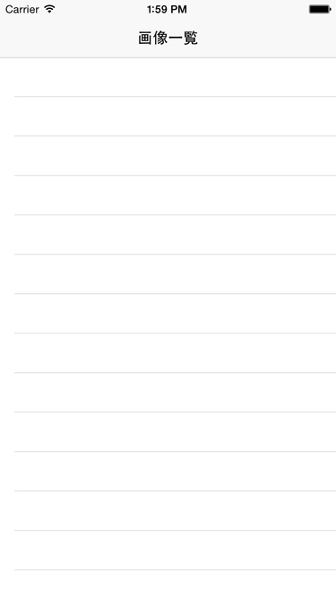
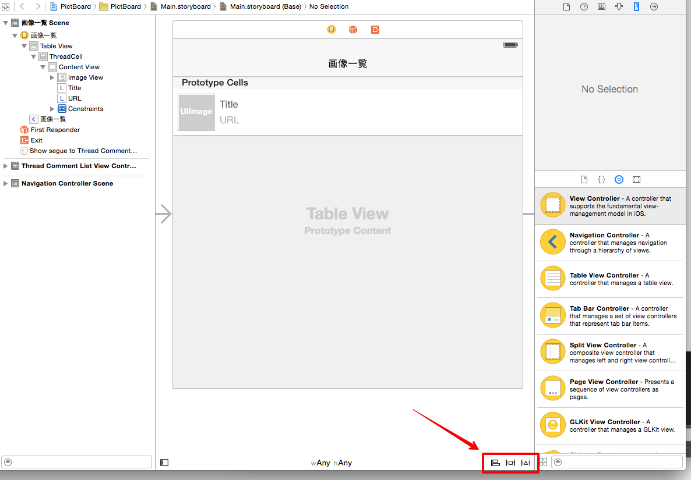

iOSアプリ開発入門

# この講義でやること

前回の講義で作った Rails アプリの API を利用して、閲覧・コメント投稿ができるiOSアプリを作成する。
簡単なアプリの実装を進めながら、iOSアプリ開発の基本を学ぶ。

# iOSアプリとは

iOSが動く端末(iPhone、iPad など)で動作するアプリケーションのこと。

MacOSX の Xcode というツールを使って Objective-C または Swift というプログラミング言語で開発できる。

# この講義で扱う開発環境

* MacOSX 10.10.4
* iOS 8.4
* Xcode 6.4
* Swift 1.2

# この講義で作るiOSアプリ

以下の機能を持つアプリケーションを作成する。

* 投稿された画像一覧を表示する
* 選択した画像に付けられたコメント一覧を表示する
* 選択した画像に対してコメントを投稿する

# このアプリの作成に必要な知識

* iOSアプリ開発の基本
* ネットワークを用いたデータの送受信
* 画像の表示
* 画面要素のレイアウトの方法
* 画面遷移の方法
* ボタンなどの操作を処理に結びつける方法

などなど

# ざっくり Swift 入門

この講義では Swift を使って iOS アプリの開発を行う。
Swift は新しいプログラミング言語で面白い機能の多い言語だが、この時間で全てを説明することはできない。
この講義の説明に最低限必要な構文と機能のみ、軽く説明する。

講義中にわからないことがあれば、質問するか公式ドキュメントを参照しながら進めて欲しい。

[The Swift Programming Language](https://developer.apple.com/library/ios/documentation/Swift/Conceptual/Swift_Programming_Language/)

## Playground

Playground という Swift のコードをインタラクティブに実行できるツールが Xcode に付属している。
File > New > Playground... をクリックし、新規 Playground を作成する。

Playground を作成すると以下の様な画面が表示され、コードを記述するとその評価結果が右ペインに表示される。
この Playground を使いつつ Swift の基本的な構文を説明していく。


# 定数・変数

## 定数

let キーワードで定数を宣言できる。
定数なので値を変更しようとするとコンパイルエラーになる。

```swift
let number = 1
let text = "Hello World!"

println(number) // => "1"
```

## 変数

var キーワードで変数を宣言できる。

```swift
var apple = 100
var banana = 200
banana = 300

println(banana) // => "300"
```

# 型

変数には型があり、整数を表現する Int 型や文字列を表現する String 型など様々な型がある。
Swift では型推論できる場合は型を省略できる。

```swift
var mango: Int = 300

println(mango) // => "300"
```

## Array

Int 型の配列は [Int] と表現する
他のプログラミング言語と同じように`[]`のなかに要素を並べて初期化できる。

```swift
let numbers: [Int] = [1, 2, 3]
var products = ["apple", "banana", "mango"]

products[1] // => "banana

products.append("mushroom") // => ["apple", "banana", "mango", "mushroom"]
products.removeAtIndex(1) // => "banana"
products // => ["apple", "mango", "mushroom"]
```

## Dictionary

String 型の値を key に Int 型の値を value としてもつ辞書は [String: Int] と表現する。
[key1: value1, key2: value2, ...] というリテラルで初期化できる。

```swift
let prices = [
    "apple": 100,
    "banana": 200,
    "mango": 500,
]
prices["banana"] // => 200

var items: [String: Int] = [:]
items["sword"] = 1
items["torch"] = 3
items["herb"] = 10
```

## Optional

通常、様々な型の変数には nil を代入することができない。
それに対し nil を代入できる Optional 型が用意されている。
nil を代入できる Int 型として Int? 型がある（正確には Optional にラップされている Int 型 `Optional<Int>`）。
非Optional型である Int に nil を代入しようとするとエラーになる。

```swift
var source: Int
source = 100
source = nil // => Cannot assign a value of type 'nil' to a value of type 'Int'

var destination: Int?
destination = 200
destination = nil // => nil
```

Optional だが nil が代入されてないものとして扱う Implicitly Unwrapped Optional 型もある。

```swift
var textLabel: UILabel!
textLabel.text = "Hello World!"
```

このように記述するとコンパイルは通るが、実行時に `textLabel` が nil なのでランタイムエラーが発生する。ほとんどの場合 Implicitly Unwrapped Optional を使う必要はない。
むしろ上記の例のように安全でないコードが書けてしまうので避けるべきである。

# 制御構文

## if

```swift
if count < 10 {
    println("\(count)!")
}
```

Optional binding という機能もある。
String#toInt() は Int? を返すメソッドであり、以下の例では数値に変換できた場合のみ actualNumber に値を束縛しブロックの処理を実行する。

```swift
var possibleNumber = "123"
if let actualNumber = possibleNumber.toInt() {
    println("\'\(possibleNumber)\' has an integer value of \(actualNumber)")
} else {
    println("\'\(possibleNumber)\' could not be converted to an integer")
}
// => '123' has an integer value of 123
```

## for

```swift
for var i = 0; i < 10; i++ {
    println(i)
}
```

Range も使える。0..<10 と 0...10 があり、前者は10を含まず後者は10を含む。

```swift
for i in 0..<10 {
    println(i) // 10 times
}
```

Array, Dictionary の for-in

```swift
for product in products {
    println(product)
}

for (name, price) in prices {
    println("\(name) => \(price)")
}
```

# クラス・メソッドの定義

```swift
class Creature {
    let name: String

    init(name: String) {
        self.name = name
    }

    func attack() -> Int {
        return 10
    }
}

class FlyingCreature: Creature {
    func fly() {
        // ...
    }

    override func attack() -> Int {
        return 20;
    }
}
```

# インスタンスの作成

```swift
let elephant = Creature(name: "elephant")
```

# メソッド呼び出し

Creature 型のインスタンス creatureA があるとする。
Creature クラスに attack() -> Int というメソッドが定義されていた場合、以下のようにして呼び出すことができる。

```swift
creatureA.attack() // => 10 (Int)
```

次に、Creature? 型のインスタンス creatureB があるとする。
creatureB が nil でなければ attack() メソッドを呼ぶということを以下のように書ける(アンラップしてメソッドを呼ぶ)。
creatureB は Optional なのでこのように書かないとコンパイルエラーになる。

```swift
creatureB?.attack() // => 10 (Int?)
```

creatureB が nil でないと仮定して強制的にメソッドを呼び出すこともできる。

```swift
creatureB!.attack() // => 10 (Int)
```

この場合コンパイルは通るが、実行時に creatureB が nil だった時ランタイムエラーが発生する。

`?` を常に使ったほうが良いように思えるが、`?` を使った場合は、式の評価結果が Optional になるという点が `!` と違う。
上記の例で言えば attack() メソッドの返り値が非 Optional だったとしても `?` の場合は Optional にラップされ、`!` の場合は非 Optional のままとなる。

```swift
let creatureA = Creature(name: "A")
let creatureB: Creature? = Creature(name: "B")

let case1 = creatureA.attack()
let case2 = creatureB?.attack()
let case3 = creatureB!.attack()

case1.dynamicType // => Swift.Int
case2.dynamicType // => Swift.Optional<Swift.Int>
case3.dynamicType // => Swift.Int
```

# プロジェクトの作成

Swift の構文がざっくりわかったところでアプリの開発を始める。
Xcode で新規プロジェクトを作成する。

Welcome to Xcode 画面で Create a new Xcode project を選択する。
もちろん他のやり方でもプロジェクトが作成できればよい。


テンプレートから `Single View Application` を選択する。


プロジェクトの情報を入力する。
プロジェクト名は `PictBoard` とした。
Language は `Swift` を選択する。


# プロジェクト構成
 
iOSアプリのプロジェクトには以下のものが含まれる。

* .xcodeproj - プロジェクトファイル、プロジェクトそのもの
* .h, .m - Objective-C のヘッダファイル、実装ファイル
* .swift - Swift のソースファイル
* .storyboard - 画面間の遷移を含む、画面のレイアウトファイル
* .plist - 設定ファイルなど
* .png - 画像ファイル

などなど

必要に応じて新しいファイルを追加してコードを書いたり、リソースファイルの設定をしたりしてアプリを開発していく。

# ファイルグループの設定

プロジェクトナビゲータで PictBoard グループを選択した後、右クリックし `New Group` を選択、グループ名を入力する。


今後必要になるので、Model, View, ViewController の3つのグループを作成する。


右側のユーティリティを開き、ディレクトリのアイコンを選択することでパスの設定画面が出てくるので、グループと同名のディレクトリを作成して選択する。


# 画像一覧画面の作成

はじめに投稿された画像の一覧を表示する画面を作成する。

## Storyboard に TableViewController を追加する

プロジェクトナビゲータで Main.storyboard ファイルを選択し、画像一覧画面を作成する。


最初からある ViewController は必要ないので削除する。
ViewController.swift も合わせて削除する。

TableViewController を追加する。


追加した TableViewController を NavigationController の中にいれる。


以下の様な状態になればOK。


この NavigationController がアプリ起動時に表示されるように設定する。
NavigationController を選択して右側のユーティリティの `Is Initial View Controller` のチェックをいれる。
設定すると NavigationController の左側に矢印が表示される。


## ThreadListViewController クラスのファイルを追加する

画像一覧画面の ViewController として `ThreadListViewController` を作成する。
ViewController グループを右クリックし、`New File...` からファイルを作成できる。


ThreadListViewController.swift を作成する。

Template は `Cocoa Touch Class` を選択する。


`Subclass of` の項目は `UITableViewController` を選択する。
すると適切なテンプレートからファイルを作ってくれる。


Storyboard を開いて先に作った TableViewController と ThreadListViewController を対応づける。


設定した ThreadListViewController の ナビゲーションバーのあたりをダブルクリックし、タイトルを編集する。


ここまで設定してビルド・実行してみると、何もないテーブルビューが表示される。



# UITableView とは
UITableView は、複数のセルを並べて表やリストを表示するためのViewである。
セルはセクションという単位で区切ることができる。


# TableViewDataSource の実装

UITableView に内容を表示したりセルのタップに反応したりするためには、2つのプロトコルに準拠する必要がある。

* UITableViewDataSource - TableView に表示するセルの設定などを行う
* UITableViewDelegate - セルがタップされた時の処理など、TableView のイベント処理を行う

ThreadListViewController クラスにこの DataSource を実装し、TableView をつかって画像一覧を表示する。

以下のメソッドらは UITableViewDataSource で必ず実装しなければいけないものである。

* func tableView(_ tableView: UITableView, cellForRowAtIndexPath indexPath: NSIndexPath) -> UITableViewCell
  * セクションとセルのインデックスの組である indexPath で指定された位置のセルを返す
* func tableView(_ tableView: UITableView, numberOfRowsInSection section: Int) -> Int
  * セクションに含まれるセルの数を返す

UITableViewController のサブクラスとして ThreadListViewController のファイルを作成したので、これらのメソッドのひな形が書かれているはず。

試しに以下のようにコードを書き換えてみる。他のメソッドは削除してしまって構わない。

```swift
// MARK: - Table view data source

override func tableView(tableView: UITableView, numberOfRowsInSection section: Int) -> Int {
    return 10
}

override func tableView(tableView: UITableView, cellForRowAtIndexPath indexPath: NSIndexPath) -> UITableViewCell {
    let cell = tableView.dequeueReusableCellWithIdentifier("Cell", forIndexPath: indexPath) as! UITableViewCell

    cell.textLabel!.text = "Hello World!"

    return cell
}
```

Storyboard で Cell の reuseIdentifier に `Cell` を指定する。
この値はコード中で指定したものと同じものでなければならない。


問題なければ以下のように表示されるはず。


# 投稿画像一覧を管理するクラスを作る

投稿画像やそれにつけられたコメントをアプリ内で表現するクラスを作成する。

## Comment クラス

投稿画像に付けられたコメントを表現する Comment クラスを定義する。
Comment クラスは、コメント本文、コメント日付をプロパティに持つ。

```swift
import Foundation

class Comment {
    let body: String
    let date: NSDate

    init(body: String, date: NSDate) {
        self.body = body
        self.date = date
    }
}
```

## Thread クラス

投稿画像を表現する Thread クラスは、id、タイトル、画像URL、コメントの配列をプロパティに持つ。

```swift
import Foundation

class Thread {
    let id: Int
    let imageURL: NSURL
    let title: String
    var comments: [Comment] = []

    init(id: Int, title: String, imageURL: NSURL) {
        self.id = id
        self.title = title
        self.imageURL = imageURL
    }
}
```

## ThreadStore クラス

投稿画像を束ねる ThreadStore クラスを作る。
投稿画像一覧を取得する処理は後述する。

```swift
import Foundation

class ThreadStore {
    var threads: [Thread] = []
}
```

# 投稿画像一覧を取得する

投稿画像一覧を取得する `retrieveThreads` メソッドを ThreadStore クラスに実装する。
投稿画像一覧取得 API を実行するリクエストを送信し、レスポンスを前節で定義したクラスのインスタンスに割り当てる処理を記述する。リクエストの実行が完了したタイミングで追加の処理を行えるようブロックを引数に渡せるようにする。

```swift
func retrieveThreads(block: ((error: NSError?) -> Void)?) {
    let apiURL = NSURL(string: "http://localhost:3000/images.json")!

    let downloadTask = NSURLSession.sharedSession().dataTaskWithURL(apiURL, completionHandler: { data, response, error in
        if error != nil {
            block?(error: error)
            return
        }

        var jsonError: NSError?
        let jsonObject = NSJSONSerialization.JSONObjectWithData(data!, options: NSJSONReadingOptions(0), error: &jsonError) as? NSDictionary
        if jsonError != nil {
            block?(error: jsonError)
            return
        }
        println(jsonObject!)

        var threads: [Thread] = []
        if let images = jsonObject?["images"] as? NSArray {
            for image in images {
                let id = (image["id"] as! NSNumber).integerValue
                let title = image["title"] as! String
                let imageURLString = image["url"] as! String
                let imageURL = NSURL(string: imageURLString)!

                let thread = Thread(id: id, title: title, imageURL: imageURL)
                threads.append(thread)
            }
        }
        self.threads = threads

        block?(error: nil)
    })
    downloadTask.resume()
}
```

`((error: NSError?) -> Void)?` という型は closure であり、 NSError? 型を引数に持ち、何も返さない closure であることを表す(? がついてるのでOptional)。
retrieveThreads メソッドの画像一覧取得処理が完了した後に、呼び出し元で指定した追加の処理を実行したい場合がある。
例えば、一覧の取得が完了した後にそれを画面に反映させたい場合がこれにあたる。
このような非同期の処理が必要な場合に closure を使うとわかりやすく記述できる。

as? や as! はダウンキャストのための演算子である。
as? は左辺の値を右辺の型でダウンキャストできるときにその値を、できない場合は nil を返す。
as! は左辺の値を右辺の型で必ずダウンキャストできるものとして強制的にダウンキャストする。当然できない場合はランタイムエラーになる。

# 画像一覧のタイトルだけでも表示してみる

画像一覧画面が表示されるときに上記の `retrieveThreads` メソッドを実行し、一覧のタイトルだけでも表示してみる。

UIViewController には `viewWillAppear(animated: Bool)` というメソッドがあり、画面が表示される前に呼ばれる。ここで`retrieveThreads` メソッドを実行すればよい。

ThreadListViewController を以下のように修正する。

```swift
let threadStore = ThreadStore()
```

```swift
override func viewWillAppear(animated: Bool) {
    super.viewWillAppear(animated)

    threadStore.retrieveThreads { error in
        if error != nil {
            println(error!.localizedDescription)
            return
        }

        dispatch_async(dispatch_get_main_queue(), {
            self.tableView.reloadData()
        })
    }
}
```

```swift
override func tableView(tableView: UITableView, numberOfRowsInSection section: Int) -> Int {
    return threadStore.threads.count
}

override func tableView(tableView: UITableView, cellForRowAtIndexPath indexPath: NSIndexPath) -> UITableViewCell {
    let cell = tableView.dequeueReusableCellWithIdentifier("Cell", forIndexPath: indexPath) as! UITableViewCell

    let thread = threadStore.threads[indexPath.row]
    cell.textLabel!.text = thread.title

    return cell
}
```

画像一覧の取得が正常に終わったら tableView の reloadData() を呼ぶ。
tableView の DataSource のメソッド群を ThreadStore から値を取るように書き換えると、取得した画像一覧を画面に反映できる。

# カスタム TableViewCell を作る

投稿画像の画像サムネイル、タイトル、URLを表示するカスタムセルを作る。
カスタムセルにはImageView や Label などの表示要素を配置し、コードから操作できるようする必要がある。

以下の手順で作業を進める。

1. Storyboard 上で ImageView, Label を配置する
1. ThreadCell クラスファイルを作成する
1. 画面要素とクラスを対応付ける

## Storyboard 上で ImageView, Label を配置する

セル上に以下の要素を貼り付ける。
レイアウトの条件は以下のようにする。


* thumbnailImageView(UIImageView) 画像サムネイルを表示する
	* 64x64px のサイズ
	* セルの左余白にぴったりつける
	* セルの上下から 8px の余白を作る
* titleLabel (UILabel) スレッドタイトルを表示する
	* セルの上から 8px の余白を作る
	* ImageView から水平方向 8px の余白を作る
	* セルの右余白にぴったりつける
	* 可能な限り幅を取る
* urlLabel (UILabel) 画像のURLを表示する
	* titleLabel下から 6px の余白を作る
	* ImageView から水平方向 8px の余白を作る
	* セルの右余白にぴったりつける
	* 可能な限り幅を取る

まず、TableView のセルの高さを 80 に設定する。TableView を選択した状態で右側の Size Inspector の row Height の値を変更する。


セルに対して ImageView, Label を追加していく。 右側の ObjectLibrary からドラッグ・アンド・ドロップで追加できる。


UIImageView に対しては Attributes Inspector の View の項目で `Aspect Fit` を設定しておこう。
この設定により、画像を設定した時に画像のアスペクト比を保ったまま、Viewにおさまるように表示してくれる。

## AutoLayout

AutoLayout という画面要素の配置に制約を設定することで、レイアウトを自動的に行う仕組みがある。
上記の条件でレイアウトが行われるように各要素に制約(Constraint)を設定していく。

View を選択した状態で、以下のボタンを押すことで制約を設定できる。



* Align - 整列に関する制約を追加できる。
 


* Pin - マージンや幅・高さに関する制約を追加できる。
 


* Resolve Auto Layout Issues -  AutoLayoutに関する問題を解決する。


ImageView には以下の様に制約を指定できるだろう。
同様に titleLabel, urlLabel に対しても設定していく。


## ThreadCell クラスファイルを作成する

UITableViewCell のサブクラスとして ThreadCell クラスを作る。
ThreadListViewController の時と同じようにして View グループにファイルを作成する。

## 画面要素とクラスを対応付ける

セルのクラスと identifier を設定する。
セルを選択し、右ペインのメニューから以下のように設定できる。


次にImageViewなどの要素をクラスのメンバ変数と結びつける。
Assistant Editor を使って Storyboard とソースコードの画面を並べて表示し、Storyboard上の要素をCtrlを押しながらクリックすると青い線が伸びるのでソースコード上までひっぱる。
はなすとクラス名や変数名を入力するふきだしがでるので、適切なものを入力する。


thumbnailImageView, titleLabel, urlLabel の3つの設定ができると以下のような状態になる。
ソースコードからは awakeFromNib, setSelected などのメソッドを削除してしまってもかまわない。


## セルに値を設定する

ThreadCell を実装したら、ThreadListViewController でもそれを使うように修正する。

```swift
override func tableView(tableView: UITableView, cellForRowAtIndexPath indexPath: NSIndexPath) -> UITableViewCell {
    let cell = tableView.dequeueReusableCellWithIdentifier("ThreadCell") as! ThreadCell

    let thread = threadStore.threads[indexPath.row]
    cell.titleLabel.text = thread.title
    cell.urlLabel.text = thread.imageURL.absoluteString

    return cell
}
```

# 画像を表示する

ImageView に画像を表示するには以下の手順が必要となる。

* 画像URLにリクエストして画像データを取得する
* 画像データから UIImage クラスのインスタンス image を作成する
* ImageView に image を設定する

これらの手順は以下の様なコードで実現できる

```swift
let downloadTask = NSURLSession.sharedSession().dataTaskWithURL(imageURL, completionHandler: { data, response, error in
    if error == nil {
        if let image = UIImage(data: data) {
            dispatch_async(dispatch_get_main_queue(), {
                imageView.image = image
            })
        }
    }
})
downloadTask.resume()
```

このコードでは画像の読み込みを非同期に行い、読み込みが終わって image インスタンスを作ることができたらメインスレッドで imageView に設定している。
この処理を `tableView:cellForRowAtIndexPath:` で行えばスレッドの画像を表示できる。

しかし、以下の点について考えるとどうだろう…？

* セルが表示されるたびに画像の読み込みが行われるのではないか？
* 一度読み込んだ画像は再度取得する必要がないのではないか？

# 読み込んだ画像をキャッシュする

読み込んだ画像をキャッシュして、同じURLの画像を表示しようとしたらキャッシュがないか確認し、あればそれを使うようにする。
前のコードに少し処理を足し、読み込んだ後に画像をキャッシュしてキャッシュが存在すればそれを使うようにしたのが以下のコードである。

```swift
let imageCache = NSCache()
```

```swift
if let image = imageCache.objectForKey(imageURL) as? UIImage {
    imageView.image = image
} else {
    println("request image: \(imageURL)")
    let downloadTask = NSURLSession.sharedSession().dataTaskWithURL(imageURL, completionHandler: { data, response, error in
        if error == nil {
            if let image = UIImage(data: data) {
                self.imageCache.setObject(image, forKey: imageURL)

                dispatch_async(dispatch_get_main_queue(), {
                    imageView.image = image
                })
            }
        }
    })
    downloadTask.resume()
}
```

これで本当に問題がなくなっただろうか。
次は以下のことが気になってくるのでは…？

* 他の画面を追加した時にもこのキャッシュを使いたい。この実装ではこの ViewController でしか使えない。
* アプリを終了してもキャッシュが残ってて欲しい（メモリキャッシュでなくファイルキャッシュにしたい）

画像の読み込みとそのキャッシュを考えていくと結構大変なことが分かってくる。

# 外部ライブラリを使用する

自前で画像読み込み・キャッシュ機構を作るのは複雑で大変なので、オープンソースのライブラリを利用することにする。
画像の読み込みとそのキャッシュの面倒を良い感じにみてくれる [SDWebImage](https://github.com/rs/SDWebImage) というライブラリがあるので今回はこれを使う。

## CocoaPods

iOS/OSX アプリの開発時に効率よく外部ライブラリをプロジェクトに追加する仕組みとして [CocoaPods](https://cocoapods.org/) がある。
CocoaPods は Ruby でいう Bundler のようなツールであり、 Podfile というファイルへ使いたいライブラリ(Pod)を列挙するだけで簡単にプロジェクトに取り込むことができる。

## CocoaPods を利用してSDWebImage を導入する。

以下のように記述した Podfile を用意する。

```ruby
source 'https://github.com/CocoaPods/Specs.git'
platform :ios, '8.4'
use_frameworks!

pod "SDWebImage"
```

Podfile を用意したら以下のコマンドを実行する。

```sh
pod install
```

コマンドを実行すると以下のようなメッセージが表示されるので、一旦プロジェクトを閉じ、xcworkspaceを開く。

```
Downloading dependencies
Installing SDWebImage (3.7.3)
Generating Pods project
Integrating client project

[!] Please close any current Xcode sessions and use `PictBoard.xcworkspace` for this project from now on.
```

## BridgingHeader ファイルの作成

SDWebImage は Objective-C で書かれたライブラリなので Swift から呼び出すのに BridgingHeader を用意する必要がある。
プロジェクトに仮の Objective-C ソースコードファイルを追加すると、以下のように BridgingHeader を用意するか確認するダイアログが出るので、YES をクリックするとファイルの作成とプロジェクト設定を自動で行ってくれる。
`PictBoard-Bridging-Header.h` がプロジェクトに追加されたことを確認したら、仮に追加した Objective-C のファイルは削除してしまって構わない。


作成された PictBoard-Bridging-Header.h に以下の1行を追加する。
これは SDWebImage で追加される UIImageView のカテゴリをこのプロジェクトで利用できるようにするものである。

```objc
#import <SDWebImage/UIImageView+WebCache.h>
```

# SDWebImage を使って画像を表示する

SDWebImage が導入できたところで、画像の読み込みとImageViewを設定したところを書き直してみる。
SDWebImage を使うと以下の1行で済んでしまう。

```swift
imageView.sd_setImageWithURL(thread.imageURL)
```

UIImage のインスタンスではなく代わりに画像のURLを渡すだけで、画像の読み込みとキャッシュの処理を行ってくれる。

# 画像詳細画面の作成

画像とそれにつけられたコメントの一覧表示、新規コメントの投稿ができるような画像詳細画面を作成する。
この画面をThreadCommentListViewと呼ぶ。


## 画面要素の配置

以下の条件でレイアウトする。

* imageView(UIImageView) 画像を表示する
* commentListView(UITableView) コメント一覧を表示する
* newCommentTextField(UITextField) 新規投稿コメントを入力する
* postCommentButton(UIButton) コメント投稿ボタン


画像の幅高さ比は AspectRatio の Constraint で表現できる。
その際、画像の幅=画面幅が決定してからアスペクト比を適用してほしいので、priorityを999にする（他のpriority は 1000）。

画像一覧画面と同じように ThreadCommentListViewController クラスのファイルも作成し、各画面要素をつなげる。

commentListView(UITableView) は dataSource と delegate の設定も必要なので、ViewControllerを指定しておく。
後に、ThreadCommentListViewController へ dataSource と delegate の実装も行う。

# Storyboard を用いた画面遷移

画像一覧画面から画像詳細画面への遷移をStoryboardで設定する。

## 画面遷移の設定

画像一覧画面のセルをタップしたら、セルに表示されている画像の詳細画面に遷移して欲しい。
Storyboard でセルを選択した後、Ctrl を押しながらクリックすると青い線が伸びる。
遷移したい画面、ここでは画像詳細画面のViewControllerまで線を伸ばして離すと、以下の様なメニューが表示されるので Show を選択する。


こうして作られた2つの画面間の接続は Segue と呼ばれる。
この Segue に showThreadCommentList という Identifier を指定しておく。


## 情報の受け渡し

Storyboard 上での設定が終わったら、選択したセルのスレッド情報が画像詳細画面に渡るようにコードを記述する。
Storyboard で設定した遷移が実行されるとき、ViewController の prepareForSegue が呼ばれる。
そのため、このメソッドを override して遷移先の画面に情報を受け渡す処理を記述すればよい。

以下の様なコードで thread インスタンスを commentListViewController に渡す。
ThreadCommentListViewController にもメンバ変数 thread: Thread を宣言しておく。

```swift
override func prepareForSegue(segue: UIStoryboardSegue, sender: AnyObject?) {
    if segue.identifier == "showThreadCommentList" {
        let commentListViewController = segue.destinationViewController as! ThreadCommentListViewController
        let selectedIndexPath = self.tableView.indexPathForSelectedRow()
        let selectedThread = threadStore.threads[selectedIndexPath!.row]

        commentListViewController.thread = selectedThread
    }
}
```

# 画面要素への値の設定

画像一覧画面から詳細画面へ Thread を渡せたので、これを各画面要素に反映する。

updateThreadInfo() というメソッドを定義し、これを viewWillAppear で呼ぶことにする。
ViewController の title プロパティに文字列を設定すると、ナビゲーションバーのタイトルとして表示される。

```swift
func updateThreadInfo() {
    self.title = thread?.title

    imageView.sd_setImageWithURL(thread?.imageURL)

    self.commentListView.reloadData()
}
```

# コメントリストの表示

画像一覧画面の時と同じようにカスタムセルの定義とDataSource の実装をおこなってコメントリストを表示する。

UITableViewCell にはすぐに使えるスタイルがいくつか用意されている。
ラベルのレイアウトからやるのは大変なのでコメントは RightDetail スタイルを使って表示することにする。
Storyboard で identifier と一緒にこのスタイルを設定する。
コメントセルはタップしても何も起こらないので、selection style も None を指定する。


## コメントリストの取得

スレッドにつけられたコメントリストを取得するメソッドを Thread クラスに実装する。

```swift
static var ISO8601DateFormatter: NSDateFormatter = {
    let formatter = NSDateFormatter()
    formatter.dateFormat = "yyyy-MM-dd'T'HH:mm:ss.SSS'Z'"
    formatter.timeZone = NSTimeZone(forSecondsFromGMT: 0)
    return formatter
}()
```

```swift
func retrieveComments(block: ((error: NSError?) -> Void)?) {
    let apiURL = NSURL(string: "http://localhost:3000/images/\(self.id).json")!

    let downloadTask = NSURLSession.sharedSession().dataTaskWithURL(apiURL, completionHandler: { data, response, error in
        if error != nil {
            block?(error: error)
            return
        }

        var jsonError: NSError?
        let jsonObject = NSJSONSerialization.JSONObjectWithData(data!, options: NSJSONReadingOptions(0), error: &jsonError) as? NSDictionary
        if jsonError != nil {
            block?(error: jsonError)
            return
        }
        println(jsonObject!)

        if let comments = jsonObject?["comments"] as? NSArray {
            self.comments = Array(comments).map { commentInfo in
                let body = commentInfo["body"] as! String
                let dateString = commentInfo["created_at"] as! String
                let date = Thread.ISO8601DateFormatter.dateFromString(dateString)!
                return Comment(body: body, date: date)
            }
        }

        block?(error: nil)
    })
    downloadTask.resume()
}
```

## コメントリストの表示

updateThreadInfo() を修正して、コメントの取得を実行しその後にcommentListViewを再読み込みするようにする。

```swift
func updateThreadInfo() {
    self.title = thread?.title

    imageView.sd_setImageWithURL(thread?.imageURL)

    thread?.retrieveComments { error in
        if error != nil {
            println(error!.localizedDescription)
            return
        }

        dispatch_async(dispatch_get_main_queue(), {
            self.commentListView.reloadData()
        })
    }
}
```

dataSource の実装は以下のようになるだろう。
updateWithComment(comment: Comment) のような、モデルを渡すとラベルなどに適切な値を設定するメソッドをカスタムセルのクラスに定義しておくと便利だ。

```swift
func tableView(tableView: UITableView, numberOfRowsInSection section: Int) -> Int {
    if let rows = thread?.comments.count {
        return rows
    }
    return 0
}

func tableView(tableView: UITableView, cellForRowAtIndexPath indexPath: NSIndexPath) -> UITableViewCell {
    let cell = tableView.dequeueReusableCellWithIdentifier("CommentCell") as! CommentCell

    let comment = thread!.comments[indexPath.row]
    cell.updateWithComment(comment)

    return cell
}
```

NSDateFormatter をつかって時刻を読みやすいように整形にする。

```swift
class CommentCell : UITableViewCell {
    static var defaultDateFormatter: NSDateFormatter = {
        let formatter = NSDateFormatter()
        formatter.dateFormat = "M/d HH:mm:ss"
        return formatter
    }()

    func updateWithComment(comment: Comment) {
        textLabel!.text = comment.body
        detailTextLabel!.text = CommentCell.defaultDateFormatter.stringFromDate(comment.date)
    }
}
```

# 投稿ボタンが押されたことを検知する

画面要素とメンバ変数の対応づけ（Outletの接続）と同じように、ボタン要素をCtrlクリックして青い線を伸ばしソースコード上に引っ張って離すと、OutletだけでなくActionという候補も出てくる。
Action として登録すると、ボタンを押した時に呼ばれるメソッドが作られる。
postCommentButton が押された時に呼ばれるメソッド `didTapPostCommentButton(sender: AnyObject)` を追加しよう。

試しにログを出力する処理を書いて試してみよう。

```swift
@IBAction func didTapCommentPostButton(sender: AnyObject) {
    println("tap!")
}
```

# キーボードを表示した際の処理

newCommentTextField をタップするとキーボードが出現し文字が入力できるようになるが、テキストフィールドがキーボードに隠されてしまい入力内容を見ることができない。
キーボードが出現すると同時にキーボードの上部にテキストフィールド、投稿ボタンを含むView(以下 newCommentBar と呼ぶ)を移動させる必要がある。
また、テキストの入力が終了しキーボードが隠れたら元の位置に戻さないといけない。

キーボードが表示されたり隠れたりするタイミングは、アプリケーションから届く通知を監視することで検知できる。
UIKeyboardWillShowNotification, UIKeyboardWillHideNotification という通知を監視することで、キーボードの表示・非表示状態が変わる直前にキーボードのサイズも含めてタイミングを知ることができる。

## Observer の登録

NotificationCenter に通知がきたら ViewController のメソッドを呼び出してもらうように Observer として ViewController を登録する。
また ViewController が不要になり解放されるタイミングで Observer 登録が解除されるようにする必要もある。
以下の様なコードで登録・解除ができる。

```swift
deinit {
    NSNotificationCenter.defaultCenter().removeObserver(self)
}

override func viewDidLoad() {
    let notificationCenter = NSNotificationCenter.defaultCenter()

    notificationCenter.addObserver(self, selector: "keyboardWillShow:", name: UIKeyboardWillShowNotification, object: nil)
    notificationCenter.addObserver(self, selector: "keyboardWillHide:", name: UIKeyboardWillHideNotification, object: nil)
}
```

## newCommentBar の位置の変更処理

キーボードの状態が変化したら newCommentBar を移動する必要がある。
前に newCommentBar の下部は superView の下部にぴったりつけよ（余白0px）という制約を指定した。
キーボードが表示されている間は、この余白をキーボードの高さと同じにするようにすればキーボードの上部に表示されるはずである。


余白を決める制約を ImageView などと同じように Outlet として接続する。


キーボードの状態に応じてこの制約の値を変更することで、キーボードが出現しても newCommentBar が隠れないように自動で再レイアウトしてくれるようになる。
Constraint の値を変更する keyboardWillShow/keyboardWillHide は以下のようになる。
受け取った notification の userInfo にキーボードを表示するアニメーションの時間や変更後のサイズが格納されているのでそれを利用する。

コメントリストに項目があった場合不自然な表示になってしまうので、再レイアウトと同時にコメントリスト最下部にスクロールするメソッドも実装し、呼び出すようにする。

```swift
func keyboardWillShow(notification: NSNotification) {
    let duration = notification.userInfo![UIKeyboardAnimationDurationUserInfoKey]!.doubleValue
    let frame = notification.userInfo![UIKeyboardFrameEndUserInfoKey]!.CGRectValue()
    newCommentBarBottomSpaceConstraint.constant = CGRectGetHeight(frame)

    UIView.animateWithDuration(duration, animations: {
        self.view.layoutIfNeeded()
        self.scrollToLastComment(false)
    })
}

func keyboardWillHide(notification: NSNotification) {
    let duration = notification.userInfo![UIKeyboardAnimationDurationUserInfoKey]!.doubleValue
    newCommentBarBottomSpaceConstraint.constant = 0

    UIView.animateWithDuration(duration, animations: {
        self.view.layoutIfNeeded()
        self.scrollToLastComment(false)
    })
}

func scrollToLastComment(animated: Bool) {
    if let rows = thread?.comments.count {
        let lastCellIndexPath = NSIndexPath(forRow: rows - 1, inSection: 0)
        self.commentListView.scrollToRowAtIndexPath(lastCellIndexPath, atScrollPosition: .Bottom, animated: animated)
    }
}
```

## コメント入力のキャンセル

キーボード外の部分がタップされたらコメント入力をキャンセルするようにする。
Storyboard で画像詳細画面の View に Tap Gesture Recognizer を貼りつける。
ボタンと同じようにソースコードに線を伸ばすと、View がタップされたときに実行するメソッドを追加できる。

以下のようにメソッドを実装する。

```swift
@IBAction func didCancelPostComment(sender: AnyObject) {
    newCommentTextField.resignFirstResponder()
}
```

resignFirstResponder() というメソッドを呼ぶと、テキストフィールドからフォーカスが外れ、キーボードが隠れる。

# コメント投稿処理

コメントをテキストフィールドに入力し、投稿ボタンを押したらコメントを投稿できるようにする。

## コメント投稿リクエスト送信

Thread クラスにコメント投稿リクエストを送信するメソッドを追加する。

```swift
func addComment(body: String, block: ((error: NSError?) -> Void)?) {
    let comment = Comment(body: body, date: NSDate())
    comments.append(comment)

    let apiURL = NSURL(string: "http://localhost:3000/images/\(self.id)/comments.json")!
    let parameters = "comment[body]=\(comment.body)"
    let request = NSMutableURLRequest(URL: apiURL)
    request.HTTPMethod = "POST"
    request.HTTPBody = parameters.dataUsingEncoding(NSUTF8StringEncoding)

    let postTask = NSURLSession.sharedSession().dataTaskWithRequest(request, completionHandler: { data, response, error in
        if error != nil {
            block?(error: error)
            return
        }

        let httpResponse = response as! NSHTTPURLResponse
        if httpResponse.statusCode >= 400 {
            let requestError = NSError(
                domain: "com.cookpad.ios.PictBoard",
                code: httpResponse.statusCode,
                userInfo: [NSLocalizedDescriptionKey: "\(httpResponse.statusCode) \(NSHTTPURLResponse.localizedStringForStatusCode(httpResponse.statusCode))"]
            )
            block?(error: requestError)
            return
        }

        block?(error: nil)
    })
    postTask.resume()
}
```

## 投稿処理と新規コメントの画面反映

コメントボタンが押された時の処理を以下のように記述する。
コメントが投稿されたらコメントリストを再読み込みし、リスト最下部にスクロールする。

```swift
@IBAction func didTapCommentPostButton(sender: AnyObject) {
    let body = self.newCommentTextField.text

    if count(body) == 0 {
        return
    }

    self.newCommentTextField.text = ""
    newCommentTextField.resignFirstResponder()

    postComment(body)
}

func postComment(body: String) {
    thread?.addComment(body, block: { error in
        if error != nil {
            println(error!.localizedDescription)
            return
        }

        dispatch_async(dispatch_get_main_queue(), {
            self.commentListView.reloadData()
        })
    })

    self.commentListView.reloadData()
    scrollToLastComment(true)
}
```

# 自由課題

* もっと見た目をよくしてみよう
	* 色、UIパーツの変更
	* 画像の表示方法を変えてみる
* 投稿画像一覧画面を再取得できるようにしてみよう
	* 下に引っ張ったら最新の一覧を取得するようにしてみる
* コメント一覧を再取得できるようにしてみよう
* 画像投稿もできるようにしてみよう
	* URL をそのまま入力するのは大変だから工夫が必要そう
* アプリに表示する情報の量を増やしてみよう
	* サーバ側もいじる必要がありそう
* 自分がほしいと思う機能を追加してみよう

# アプリ拡張のためのヒント集

* CocoaControls - https://www.cocoacontrols.com UI例や実装ライブラリの一覧サイト
* CocoaPods Search - http://cocoapods.wantedly.com CocoaPods のライブラリを人気順などで並び替えられる
